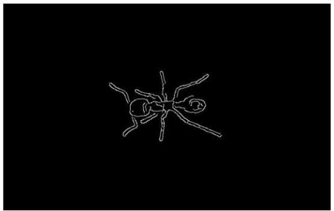
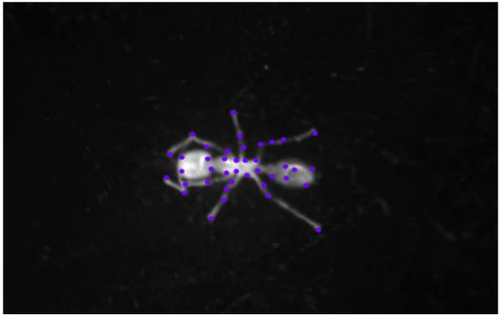
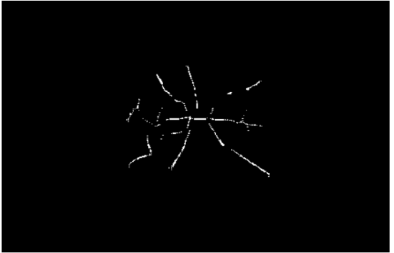
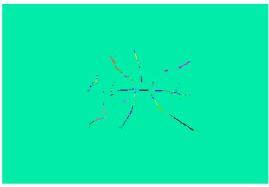
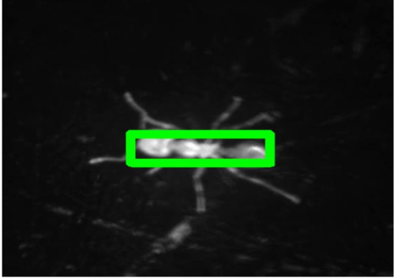
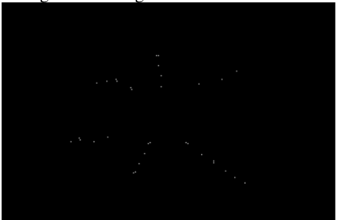
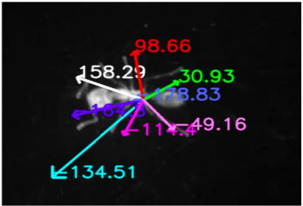
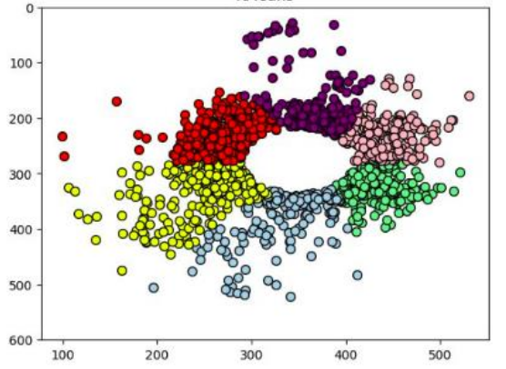
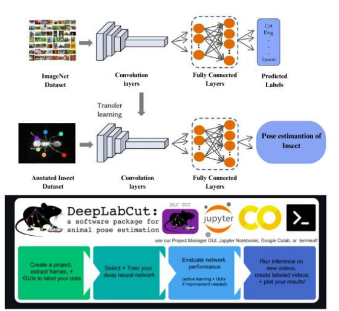

This project proposes a robust and scalable method for automating insect leg labeling using **image processing, feature detection, and clustering**, enabling seamless integration with **DeepLabCut** for behavioral analysis.

---

## Methodology Overview

### 1. Data Collection  
- Captured insect locomotion data using a **ServoSphere** robot equipped with omni-wheels and a high-speed camera.
- The camera tracked an insect (ant) placed atop the rotating sphere.

---

### 2. Preprocessing Pipeline  
- **Grayscale conversion** and **Gaussian blur** for noise reduction  
- **Canny Edge Detection** for edge enhancement  
- **Binary thresholding** and **morphological operations** for skeletonization

  
*Figure: Output after applying Canny edge detection.*

---

### 3. Feature Extraction

- Applied **Shi-Tomasi Corner Detection** on Canny edges for precise joint detection
- Robust to noise and sensitive to detailed motion features

  
*Figure: Shi-Tomasi corner detection highlights potential joint features.*

---

### 4. Body Removal

- Used **Zhang-Suen thinning** for skeleton extraction  
- Applied **connected component labeling** to segment body parts  
- Removed body via **template matching**

  
*Figure: Skeleton representation using Zhang-Suen thinning.*

  
*Figure: Connected component labeling for body part isolation.*

  
*Figure: Template matching used to isolate and remove the body region.*

---

### 5. Leg Detection

- Remaining features correspond to legs  
- Calculated angles of features w.r.t. body centroid

  
*Figure: Extracted leg features post body removal.*

  
*Figure: Angle estimation of each leg with respect to the centroid.*

---

### 6. Clustering & Tip Detection

- **KMeans (K=6)** clusters features into 6 legs  
- Furthest feature in each cluster = leg tip

  
*Figure: KMeans clustering of features into 6 leg regions.*

---

### 7. Integration with DeepLabCut

- Created `.h5` files with clustered keypoints  
- Trained DeepLabCut on auto-labeled dataset  
- Achieved performance near manual labeling

  
*Figure: Final annotated labels used with DeepLabCut.*

---

## Experimental Results

| Leg | TP (Auto) | FP (Auto) | TP (Manual) | FP (Manual) |
|-----|-----------|-----------|-------------|-------------|
| 1   | 95        | 2         | 98          | 1           |
| 2   | 90        | 3         | 95          | 2           |
| 3   | 85        | 4         | 90          | 2           |
| 4   | 80        | 3         | 85          | 3           |
| 5   | 75        | 5         | 80          | 4           |
| 6   | 70        | 3         | 75          | 3           |

> *Confusion matrix comparing auto-labeled vs manually labeled results. Accuracy slightly lower, but performance is consistent and scalable.*

---

## Key Techniques

- **Canny Edge Detection**  
- **Shi-Tomasi GFTT**
- **Template Matching**
- **KMeans Clustering**
- **Zhang-Suen Thinning**
- **DeepLabCut integration**

---

## Insights & Future Work

- Automation significantly reduced manual effort
- High reproducibility across ant datasets
- KMeans produced sharper clusters than Ensemble KMeans
- Future work may explore deep learning-based leg segmentation and adaptive clustering strategies

---

## Resources

- 📄 [Project Report (PDF)](report.pdf)
- 🔗 [GitHub Repository](https://github.com/juttu-s/Pattern-Recognition-and-Computer-Vision/tree/main/Automated%20Insect%20Leg%20Labeling)

---

This approach provides a **generalizable and scalable method** for anatomical labeling in biological research and can be extended to other multi-limbed species or anatomical joints.
