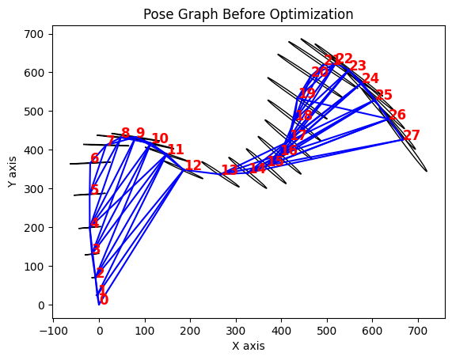
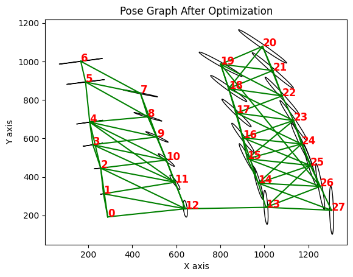

---
title: Photo Mosaicking of Low-Contrast Underwater Images
date: 2024-10-05
tags:
  - Image Registration
  - SLAM
  - GTSAM
  - OpenCV
  - Python
  - Levenberg-Marquardt
summary: A comprehensive feature-matching and mosaicking pipeline for underwater images using CLAHE, SIFT, RANSAC, affine transformation, and GTSAM-based pose graph optimization.
featured: true
image:
  filename: featured.png
  preview_only: true
---

This project implements a full photo mosaicking and optimization pipeline using low-contrast underwater images from the **Skerki Bank Roman shipwreck** dataset. The approach registers both sequential and non-sequential images using SIFT and RANSAC, computes affine transformations, and optimizes a global trajectory using GTSAM.

---

### Pipeline Breakdown

#### 1️⃣ CLAHE Image Enhancement

- Applies histogram equalization to improve contrast and enhance keypoints.
- OpenCV CLAHE was used on each grayscale frame.

```python
clahe = cv2.createCLAHE(clipLimit=2.0, tileGridSize=(8, 8))
clahe_image = clahe.apply(gray_image)
```


---

#### 2️⃣ SIFT Feature Detection

- Detected keypoints using tuned SIFT settings:
  - `nfeatures=5000`, `contrastThreshold=0.025`, `nOctaveLayers=8`, `sigma=1.5`

```python
sift = cv2.SIFT_create(...)
kp, desc = sift.detectAndCompute(image, None)
```


---

#### 3️⃣ Feature Matching + RANSAC Filtering

- Matched descriptors using Brute-Force Matcher + Lowe’s ratio test.
- Applied `cv2.estimateAffine2D` with RANSAC to compute and refine transformation.

```python
matches = bf.knnMatch(des1, des2, k=2)
good = [m for m, n in matches if m.distance < 0.75 * n.distance]
H, mask = cv2.estimateAffine2D(pts1, pts2, method=cv2.RANSAC)
```


---

#### 4️⃣ Pose Graph Construction (GTSAM)

- Built a factor graph using all non-repeating image pairs.
- Relative poses (affine transforms) were added as edges.

```python
graph.add(BetweenFactorPose2(i1, i2, T_ij, noise_model))
```

---

#### 5️⃣ Global Bundle Adjustment

- Used GTSAM’s Levenberg-Marquardt optimizer to refine global poses.
- Corrects drift and adjusts poses to minimize total residual error.

```python
optimizer = gtsam.LevenbergMarquardtOptimizer(graph, initial_estimate)
result = optimizer.optimize()
```



---

### Techniques Used

- Image normalization + CLAHE
- SIFT feature detection and matching
- RANSAC for outlier rejection
- Homography estimation using Levenberg–Marquardt
- Graph construction (GTSAM)
- Loop closure detection
- Pose optimization

---

### Results

- Successfully registered both sequential and non-sequential image pairs
- Constructed optimized pose graphs for 6 and 29 image subsets
- Achieved a ~20% improvement in alignment after bundle adjustment

---

### 📁 Related Files

- 🔗 [GitHub Repository](https://github.com/juttu-s/photo-mosaicking-skerki)
- 📁 [Skerki Dataset Reference (Google Drive)](https://drive.google.com/drive/folders/1AtvT65txGIgAG23NRs3EkvDET036a81O)
- 📓 [Project Notebook](/files/Part1_and_2.ipynb)
- 📓 [Extended Analysis](/files/Part_3.ipynb)

---

### 📖 References

- Pizarro & Singh (2003): *Toward large-area mosaicing for underwater scientific applications.*
- Ballard et al. (1998, 2000): *Roman shipwreck discovery using submersible tech.*