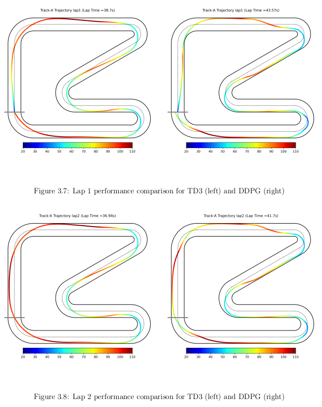
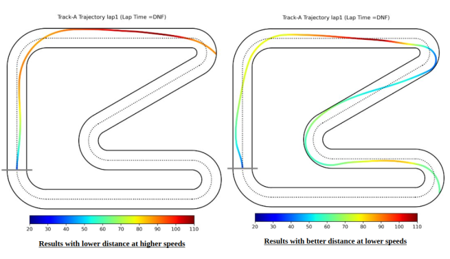

---
title: Autonomous Race Driving with Action Mapping RL
date: 2025-04-10
tags:
  - Reinforcement Learning
  - Action Mapping
  - DDPG
  - SAC
  - TD3
  - Autonomous Driving
summary: Evaluated DDPG and SAC with Action Mapping on a custom autonomous racing simulator using a friction-constrained vehicle model, comparing them to the TD3-AM benchmark from literature.
featured: true
image:
  filename: am_rl_racing.png
  preview_only: true
---

## 🏎️ Autonomous Race Driving with Action Mapping RL

This project evaluates the impact of **Action Mapping (AM)** on **deep reinforcement learning (DRL)** algorithms for high-speed autonomous race driving. The primary goal was to enforce **friction and vehicle dynamics constraints** while ensuring agents could learn to complete laps efficiently and safely.

We **extended the GitHub framework from the AM-RL paper** (ISA Transactions 2024) that used TD3 + AM, and **re-implemented the actor-critic models using DDPG and SAC** with Action Mapping. The experiments were conducted on **Track A** in the custom race simulator.

---

## Objectives

- Understand and replicate the Action Mapping Reinforcement Learning (AM-RL) framework
- Implement DDPG and SAC as alternate agents within the same setup
- Compare lap time, constraint satisfaction, and learning stability across methods

---

## Simulation & State Design

- **Environment:** Custom Python-based simulator using bicycle model dynamics
- **Observations:** 
  - 12 future curvature points from the centerline
  - Velocity, yaw rate, orientation, steering angle, and track deviation
- **Action Space:** Virtual actions ∈ [−1, 1]² → throttle & steering angle
- **Constraints:** Friction cone and lateral acceleration safety bounds

---

## Neural Networks

### Actor Networks
- Fully connected with 2 hidden layers (256–256 units)
- **Activation:** ReLU (hidden), Tanh (output)
- **Output:** Unconstrained actions (steering, throttle) passed to AM module

### Critic Networks
- Two Q-functions for SAC (double critic)
- One Q-function for DDPG
- Each accepts state-action pair and outputs scalar Q-value

### Loss Functions
- **DDPG:** MSE loss on predicted Q-values
- **SAC:** Adds entropy regularization and automatic temperature tuning

---

## Action Mapping (AM)

- State-aware mapping transforms virtual actions to safe, real-world controls
- Implemented as a lookup-based mapping based on track geometry and physics
- Ensures compliance with dynamic tire-road constraints (Fₓ, Fᵧ within friction ellipse)

---
## Results Summary

### DDPG with Action Mapping (AM)

- Learned a stable and smooth racing policy
- Consistently finished laps on Track A
- **Lap 1 Time:** 43.57s  
- **Lap 2 Time:** 41.7s  
- Maintained safety constraints with no friction violations
- Approached TD3-level performance from literature

### TD3 vs DDPG Lap Comparison

Below is a side-by-side comparison of **TD3** (left) and **DDPG** (right) for both Lap 1 and Lap 2 on Track A. Color encodes speed (m/s).

*Figure: Lap 1 and Lap 2 performance comparison — TD3 has tighter trajectories and better cornering speed than DDPG.*

---

### SAC with Action Mapping (AM)

- Frequently failed to complete laps (DNF)
- Produced two common failure modes:
  - Prioritizing speed → unstable cornering and off-track behavior
  - Prioritizing stability → very slow but accurate turns
- Final policies were inconsistent and fragile
- Highly sensitive to reward scaling and actor update frequency

*Figure: SAC Lap 1 — Left: high speed, low stability; Right: better track alignment, very low velocity.*

---

## Key Comparison Table

| Metric              | TD3-AM (paper) | DDPG-AM (ours) | SAC-AM (ours)       |
|---------------------|----------------|----------------|----------------------|
| Best Lap Time (s)   | **36.94**      | 41.7           | DNF (unstable)       |
| Constraint Violations | 0              | 0              | Some (off-track)     |
| Convergence Speed   | Fast           | Moderate       | Slow                 |
| Stability           | High           | High           | Very Low             |
---

## Resources

- 📄 [Final Report PDF](CS5180___Final_Report.pdf)
- 🔗 [Link to Original Paper](https://www.sciencedirect.com/science/article/pii/S0019057824002143?via%3Dihub)
- 🔗 [GitHub Repo](https://github.com/s-bray/CS5180-Final_Project)

---

This project demonstrates how **Action Mapping serves as a universal safety wrapper** that can be applied across different DRL algorithms. Our experiments showed that DDPG performs competitively against TD3 in constrained driving, while SAC struggled to converge due to reward instability — emphasizing the importance of choosing the right policy architecture for safety-critical RL tasks.
