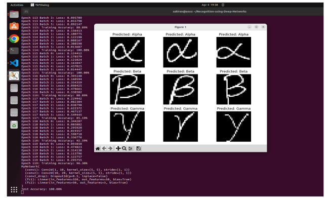

---
title: Digit Recognition & Transfer Learning with CNNs
date: 2024-04-01
tags:
  - Deep Learning
  - PyTorch
  - CNN
  - MNIST
  - Transfer Learning
summary: Built and analyzed a convolutional neural network (CNN) for handwritten digit recognition using MNIST, then applied transfer learning to recognize Greek letters and conducted real-time video-based classification.
featured: true
image:
  filename: digit_cnn.png
  preview_only: true
---

This project focused on **designing, training, and analyzing convolutional neural networks (CNNs)** for digit recognition and then **applying transfer learning** to recognize Greek characters using PyTorch.

---

## CNN for Digit Recognition (MNIST)

We first built and trained a simple CNN model using the MNIST dataset:

- Two convolutional layers (5x5 filters)
- Max pooling (2x2) and dropout (0.5)
- Fully connected layer (50 nodes) + final FC with log-softmax (10 classes)
- Achieved **~98% test accuracy**

*Figure: Example of first 6 MNIST test samples.*

---

## Network Architecture

*Figure: End-to-end architecture used for digit recognition.*

---

## Training Performance

- Loss decreased steadily over batches/epochs.
- Test loss visualized periodically across training examples.

*Figure: Negative log-likelihood training and test loss.*

---

## Filter Visualization

- First conv layer has 10 learned filters.
- Visualized using matplotlib to show edge/orientation detection.

*Figure: Learned 5x5 filters from first conv layer.*

---

## Transfer Learning to Greek Letters

- Fine-tuned MNIST CNN to classify Greek characters: α, β, γ.
- Froze earlier layers, retrained final classifier head.
- Achieved **96–98% accuracy** on unseen test samples.

*Figure: Correct classification of Greek letters using transfer learning.*

---

## Transfer Learning Training Error

- Convergence observed over 100+ epochs.

*Figure: Error vs epoch for Greek classification.*

---

## Live Webcam Digit Recognition

- Built a webcam-based interface using OpenCV
- Live input frames classified in real time using the trained CNN

*Figure: Live Webcam Digit Recognition*

> *Sometimes predictions were inaccurate due to motion blur or poor lighting, but most digits were correctly classified in real-time.*

---

## Key Takeaways

- 5x5 and 7x7 filters outperform 3x3 in MNIST CNNs
- Dropout around **0.1–0.3** provided best generalization
- Smaller batch sizes (32) resulted in better accuracy
- Greek letters transfer learning worked well with small data (~27 samples)
- Real-time system demonstrates CNNs are efficient and deployable

---

## Tools

- Python, PyTorch, OpenCV
- Jupyter Notebooks
- Matplotlib for visualization

---

## Resources

- 📄 [Project Report PDF](Project.pdf)
- 🔗 [GitHub Repository](https://github.com/juttu-s/Pattern-Recognition-and-Computer-Vision/tree/main/Recognition%20using%20Deep%20Networks)

---

This project deepened our understanding of CNN design, filter learning, transfer learning, and real-time deployment — showing the full lifecycle from dataset to deployment.