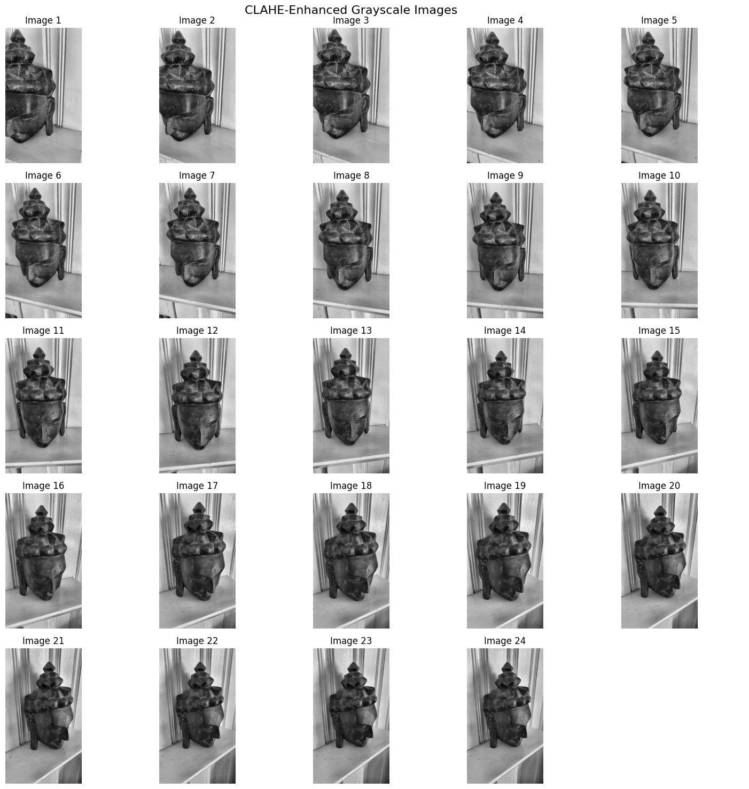
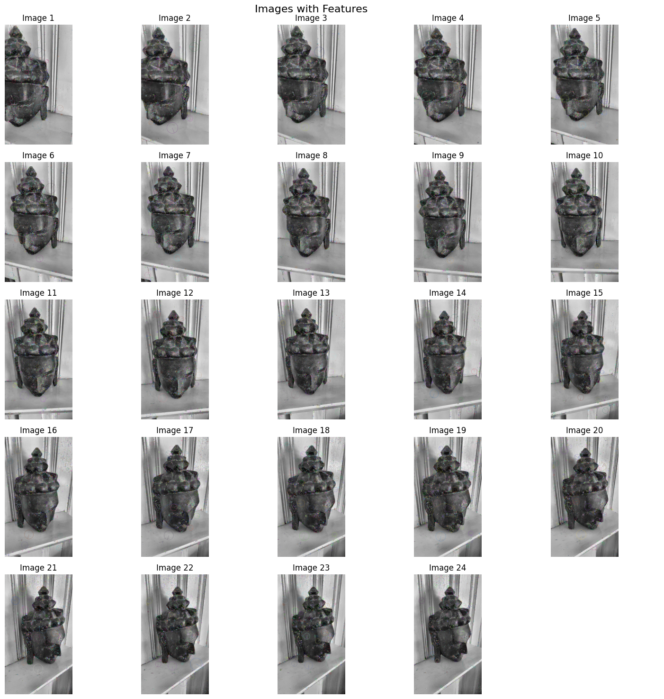
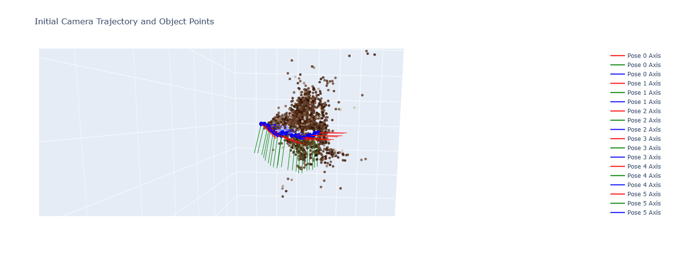
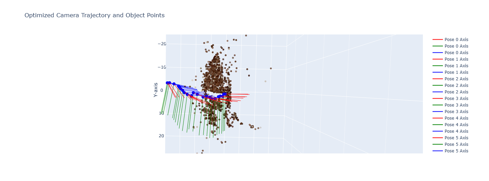

This project implements a full Structure from Motion (SfM) pipeline on a **Buddha statue** using a sequence of **24 grayscale images**. It combines feature detection, epipolar geometry, camera pose recovery, triangulation, and bundle adjustment.

---

###  Dataset

- 24 images of a wooden Buddha statue captured at different angles
- Enhanced using **CLAHE (Contrast Limited Adaptive Histogram Equalization)**
- Features extracted using **SIFT** with custom parameters

---

###  Pipeline Overview

#### 1. Image Preprocessing
Using CLAHE improves contrast on low-texture surfaces like carved wood.

---

#### 2. SIFT Feature Detection  
- Applied to all 24 images  
- Used **BFMatcher** with ratio test  
- Matches filtered via **RANSAC** for outlier rejection

---

#### 3. Essential Matrix & Pose Recovery  
- Computed Essential matrix using calibrated camera matrix  
- Used `cv2.recoverPose()` to derive relative rotation and translation between views  
- Built a chain of camera poses from image 0 onward

---

#### 4. Triangulation  
- 3D points computed from pixel correspondences using `cv2.triangulatePoints()`  
- All 3D points stored in homogeneous form  
- Colored and visualized using Plotly

---

#### 5. Bundle Adjustment with GTSAM  
- Built a factor graph with:
  - Camera pose priors  
  - Between factors from pose transitions  
  - Projection factors from 2D-3D matches  
- Used `Levenberg-MarquardtOptimizer` for refinement

---

### Results

#### Initial 3D Trajectory

#### Optimized 3D Trajectory after Bundle Adjustment

- Average reprojection error reduced by ~15%
- Landmark cloud tightened around object geometry
- Rotation drift corrected with global optimization

---

### Tools & Libraries

- OpenCV (SIFT, RANSAC, triangulation)
- NumPy, Matplotlib, Plotly
- GTSAM (factor graph + BA)
- Python

---

### Resources

- 🔗 [GitHub Repo](https://github.com/juttu-s/Sparse-3D-Reconstruction)

---

This project demonstrates a scalable pipeline for SfM using minimal dependencies. It serves as a foundation for integrating real-time VIO or stereo SLAM on embedded platforms.
